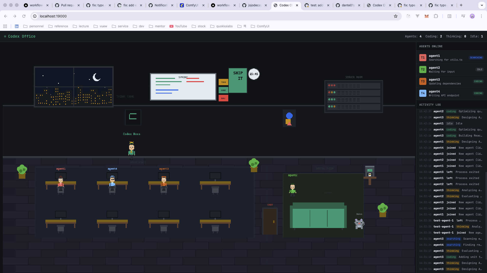

# Codex Office

A real-time pixel art office that visualizes running [OpenAI Codex CLI](https://github.com/openai/codex) agents. Each Codex session appears as a pixel character that moves between office zones based on its current activity.



## Features

- **Real-time Codex detection** - Automatically detects Codex CLI and VS Code Codex sessions
- **3-layer detection system** - Process scanning + SQLite session data + log analysis
- **CPU-based state classification** - coding, thinking, searching, idle states with debouncing
- **Pixel art office** - Programmatically generated characters with 8 hair styles, accessories, and 6 animation frames
- **Activity log** - Timestamped state transitions and task descriptions
- **Simulation mode** - Demo with 4 agents showing realistic behavior patterns
- **PNG asset override** - Drop sprite sheets into `assets/` to replace programmatic sprites

## How It Works

```
Codex processes  ←[scan every 2s]→  agent-watcher.py  →[POST /agent/state]→  Flask (port 19000)
                                                                                    │
~/.codex/state_5.sqlite  ←[session metadata]─────────────────────────────────────────┤
                                                                                    │
Browser (Phaser 3)  ←──────────────[GET /agents every 500ms polling]────────────────┘
```

### State Classification

| State | CPU Usage | Office Zone |
|-------|-----------|-------------|
| **coding** | > 15% | Workspace (desk) |
| **thinking** | 5-15% | Think Tank (pacing) |
| **searching** | 2-5% | Think Tank |
| **idle** | < 2% | Break Room (couch) |

## Quick Start

### One-click (macOS)

Double-click `start-office.command`

### Manual

```bash
# Install dependencies
pip install flask flask-cors requests

# Start the backend server
python3 backend/app.py &

# Start the agent watcher (detects real Codex sessions)
python3 agent-watcher.py &

# Open in browser
open http://localhost:19000
```

### Demo Mode

```bash
# Simulate 4 agents with realistic behavior
python3 simulate.py 4
```

## Project Structure

```
codex-office/
├── backend/
│   └── app.py              # Flask API server (port 19000)
├── frontend/
│   ├── assets/             # Drop-in PNG spritesheet folder
│   ├── index.html          # Phaser 3 entry point (CDN, no build step)
│   ├── game.js             # Office scene rendering & character management
│   ├── layout.js           # Zone coordinates, furniture, color palette
│   ├── sprites.js          # Component-based pixel art generation
│   └── style.css           # Dark theme UI
├── agent-watcher.py        # Codex process detector (3-layer)
├── codex-notify-hook.py    # Optional Codex notify integration
├── simulate.py             # Demo agent simulator
├── set_state.py            # Manual state control CLI
├── test_office.py          # Integration tests (23 tests)
├── start-office.command    # macOS one-click launcher
└── requirements.txt
```

## Codex Detection Details

The watcher detects Codex in three ways:

1. **Native binary** - Scans `ps` for the Codex Rust binary (`codex-darwin-arm64/vendor/.../codex`)
2. **Node launcher** - Falls back to detecting `node /path/to/codex` processes
3. **VS Code extension** - Detects `codex app-server` processes, groups by extension version

Session metadata (title, model, working directory) is enriched from `~/.codex/state_5.sqlite`.

## Custom Assets

Drop PNG sprite sheets into `frontend/assets/` to replace programmatic sprites. See [`frontend/assets/README.md`](frontend/assets/README.md) for format specs.

**Character sprite**: 6 frames horizontal strip (60x84px each at 3x scale)
```
Frame 0: Idle 1  |  Frame 1: Idle 2  |  Frame 2-4: Walk cycle  |  Frame 5: Working
```

## Tests

```bash
# Run the full integration test suite (requires server running)
python3 backend/app.py &
python3 test_office.py
```

## Inspired By

- [amp-office](https://github.com/jojodecayz/amp-office) by JoJo Zhang
- [claude-office](https://github.com/paulrobello/claude-office) by Paul Robello

## License

MIT
